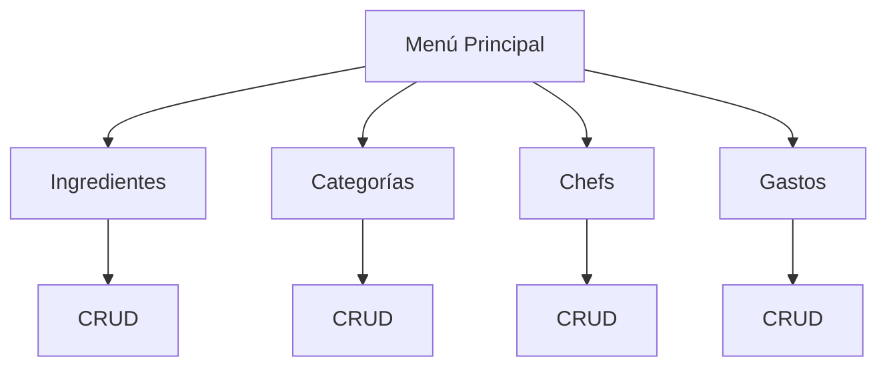

<div align="center">

# Gestor de Cafetería CampusLands  
**Sistema CRUD para Inventario y Gastos**


---

**JOHAN MONSALVE**  


</div>

---

## Descripción del Proyecto

**Gestor de Cafetería CampusLands** es un **sistema de gestión de inventario y gastos** desarrollado en **Python**, diseñado para optimizar el control de:

- Ingredientes  
- Categorías de hamburguesas  
- Chefs  
- Costos asociados  

> **Operaciones CRUD completas** (Crear, Leer, Actualizar, Eliminar) sobre todos los módulos.  
> **Datos persistentes en archivos JSON** – ¡Nunca pierdas tu inventario!

---

## Funcionalidades

| Módulo | Acciones Disponibles |
|-------|------------------------|
| **Ingredientes** | Registrar, ver, actualizar, eliminar |
| **Categorías** | Gestionar tipos de hamburguesas |
| **Chefs** | Control de personal y asignaciones |
| **Gastos** | Seguimiento por ítem y período |


# 🛠️ Tecnologías Usadas

| Tecnología     | Uso                              |
|----------------|----------------------------------|
| **Python 3**         | Lógica, menús y operaciones CRUD        |
| **JSON**      | Almacenamiento persistente (ingredientes.json, categorias.json, etc.)           |
| **Módulos nativos**     | json, datetime         |


> *100% estático – sin dependencias externas*

## ⚙️ Instalación y Uso

Sigue estos pasos para ejecutar el proyecto localmente🧑‍💻👇:

```bash
# 1️⃣ Clonar el repositorio
git clone https://github.com/Johanbadillo/Examen_Python_MonsalveJohan.git

# 2️⃣ Entrar al directorio
cd Examen_Python_MonsalveJohan

# 3️⃣ Ejecutar el programa
python3 Examen_Python_MonsalveJohan.py
```


> *Archivos JSON generados automáticamente al primer uso*


## 📁 Estructura del proyecto
```
📁 Examen_Python_MonsalveJohan/
├── 📁 Data/
│   ├── data.json
│   ├── dataCategorias.json
│   ├── dataChefs.json
│   └── logs.json
├── 📁 Funciones/
│   ├── funciones.py
│   ├── funcionesJson.py
│   └── funcionesMensajes.py
├── Examen_Python_MonsalveJohan.py    Programa principal
├── LICENSE
└── README.md
```

## Ejemplo de Uso (Consola)
```
=== GESTOR DE CAFETERÍA CAMPUSLANDS ===
1. Ingredientes
2. Categorías
3. Chefs
4. Gastos
5. Salir
> 1
> 1. Registrar nuevo ingrediente
Nombre: Pan
Costo: 1500
Stock: 50
[Success] Ingrediente registrado!
```

## Explicación Técnica

Este sistema implementa el **patrón CRUD** sobre múltiples entidades relacionadas:

- **Persistencia:** Cada módulo guarda su estado en un archivo JSON independiente
- **Validación:** Entradas numéricas, nombres únicos, stock positivo
- **Modularidad:** Funciones separadas por responsabilidad
- **Interfaz clara:** Menús anidados y mensajes de confirmación


## 👥 Autor

<div align="center">

| 🧑‍💻 Nombre | 🎯 Rol | 🔗 GitHub |
|--------|-----|--------|
| **Johan Monsalve** | ⚙️ Python Developer | [@Johanbadillo](https://github.com/Johanbadillo) |

</div>

---

<div align="center">

**💖 ¡Optimiza tu cafetería, un ingrediente a la vez! 💖**  
**CampusLands • Cajasan • 2025**

</div>
