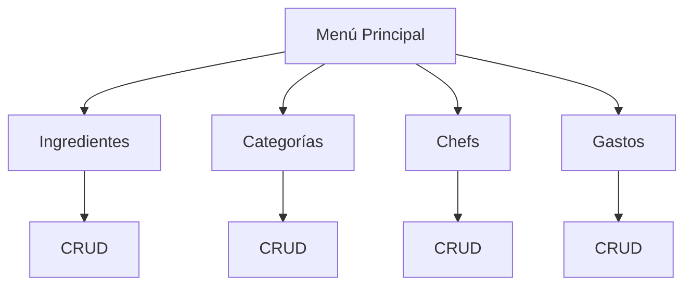

# Gestor de Cafetería CampusLands  
**Sistema CRUD para Inventario y Gastos**

---

**JOHAN MONSALVE**  

---

## Descripción del Proyecto

**Gestor de Cafetería CampusLands** es un **sistema de gestión de inventario y gastos** desarrollado en **Python**, diseñado para optimizar el control de:

- Ingredientes  
- Categorías de hamburguesas  
- Chefs  
- Costos asociados  

> **Operaciones CRUD completas** (Crear, Leer, Actualizar, Eliminar) sobre todos los módulos.  
> **Datos persistentes en archivos JSON** – ¡Nunca pierdas tu inventario!

---

## Funcionalidades

| Módulo | Acciones Disponibles |
|-------|------------------------|
| **Ingredientes** | Registrar, ver, actualizar, eliminar |
| **Categorías** | Gestionar tipos de hamburguesas |
| **Chefs** | Control de personal y asignaciones |
| **Gastos** | Seguimiento por ítem y período |

